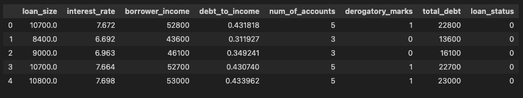
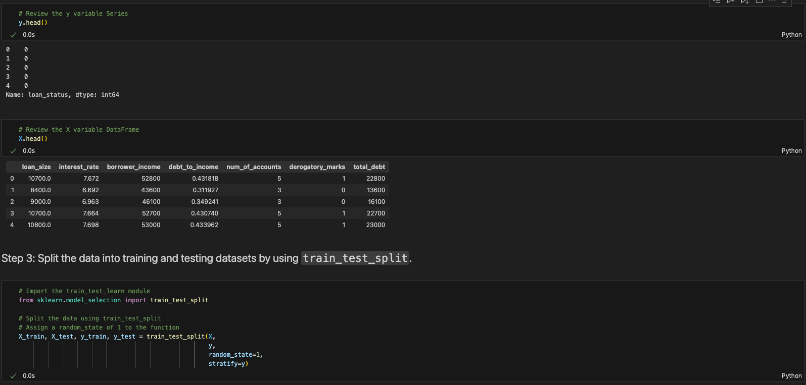
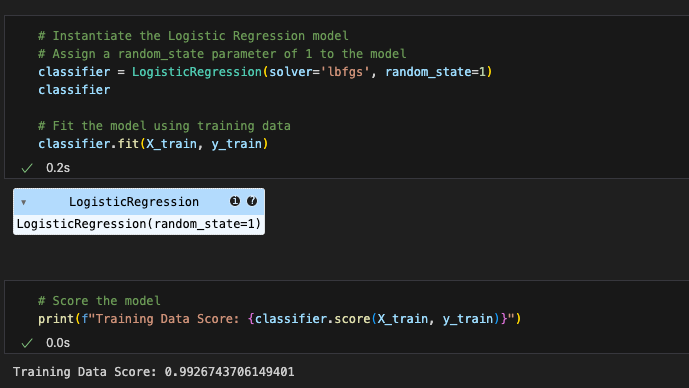
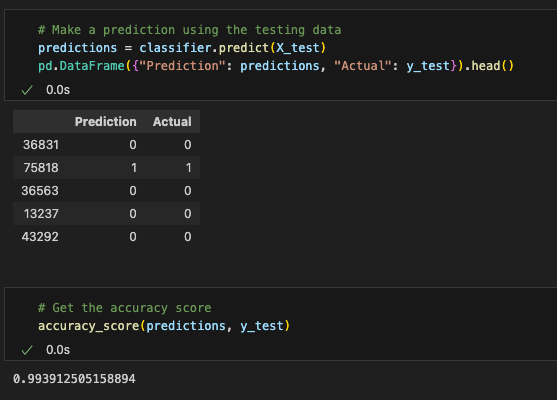
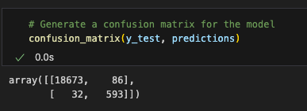
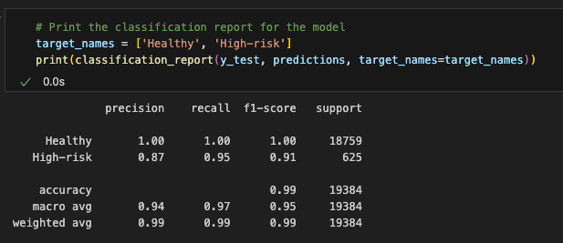

# Credit Risk Classification Challenge

In this Challenge, various techniques are used to train and evaluate a model based on loan risk.

A dataset of historical lending activity from a peer-to-peer lending services company is used to build a model that can identify the creditworthiness of borrowers.

## 1. Split the Data into Training and Testing Sets

**Dataset**

**Data Split**

## 2. Create a Logistic Regression Model with the Original Data

**Model**

**Predictions**

**Confusion Matrix**

**Classification Report**

- How well does the logistic regression model predict both the 0 (healthy loan) and 1 (high-risk loan) labels?

**99.54% of the Healthy loans were correctly predicted as Healthy by the model**

**94.88% of the High-risk loans were correctly predicted as High-risk by the model**

## 3. Write a Credit Risk Analysis Report

### Overview of the Analysis

* Explain the purpose of the analysis.
* Explain what financial information the data was on, and what you needed to predict.
* Provide basic information about the variables you were trying to predict (e.g., `value_counts`).
* Describe the stages of the machine learning process you went through as part of this analysis.
* Briefly touch on any methods you used (e.g., `LogisticRegression`, or any other algorithms).

### Results

- Accuracy score *(TP + TN) / (TP + TN + FP + FN)*:

**(19,266 / 19,384) = 99.39%**
**99.34% of the loans were correctly predicted as Healthy or High-risk.**

- Precision score *TP / (TP + FP)*:

**(593 / 679) = 87.33%**
**87.33% of the Predicted High-risk loans are actually High-risk loans.**

- Recall score *TP / (TP + FN)*:

**(593 / 625) = 94.88%**
**94.88% of the High-risk loans were correctly predicted as High-risk loans.**

## Summary

Summarize the results of the machine learning models, and include a recommendation on the model to use, if any. For example:

* Which one seems to perform best? How do you know it performs best?
* Does performance depend on the problem we are trying to solve? (For example, is it more important to predict the `1`'s, or predict the `0`'s? )

If you do not recommend any of the models, please justify your reasoning.
